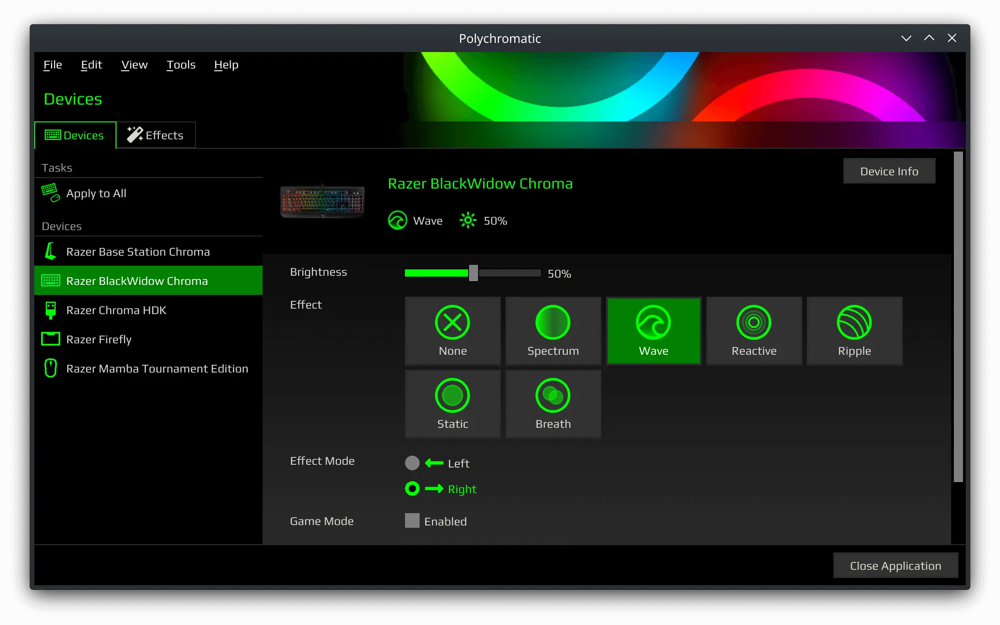

An open source RGB lighting management front-end application to customise
[OpenRazer] peripherals on GNU/Linux. Soon to be vendor agnostic!

### [https://polychromatic.app](https://polychromatic.app)

## About

Polychromatic is a vendor agnostic front-end for managing lighting, RGB effects
and some special functionality for keyboards, mice, keypads and just about any
other gaming peripheral on your GNU/Linux system.

The software aims to make it easy to create and co-ordinate lighting effects
that work across all compatible hardware, even if you switch to another brand
also supported by Polychromatic.

<!--
Presets and triggers enables you to switch your lighting on-the-fly
to match the application or game that's currently playing.
-->

[View Features](https://polychromatic.app/features/) |
[View Screenshots](https://polychromatic.app/screenshots/) |
[View FAQs and Documentation](https://docs.polychromatic.app/)

## Device Support

Polychromatic on its own is just a frontend, it needs at least one backend
installed to provide the actual communication with the hardware.

**Currently, [OpenRazer](https://openrazer.github.io) is the only supported
backend at the moment.** (Being vendor agnostic is a fairly new objective!)

In future, this project would like to add support for:

* [OpenRGB](https://github.com/polychromatic/polychromatic/issues/340) - supports many brands, including GPU, MB and RAM modules.
* [phue](https://github.com/polychromatic/polychromatic/issues/296) - for Philips Hue support

> **Note:** Between v0.7.0 and the next version, there will be some major
> refactoring in the backend classes.

[View Device List](https://polychromatic.app/devices/)

## Download

Instructions for each supported distro are provided on the website:

* <https://polychromatic.app/download/>

Installing packages from a software repository is recommended as this will keep
the software up-to-date.

Alternately, providing all the [dependencies](https://docs.polychromatic.app/dependencies/)
are installed, you can run the application directly from the repository without
installation.  Your configuration and cache is isolated to a `savedatadev` directory
when running via `polychromatic-controller-dev`. To isolate for other components,
set this environment variable:

    export POLYCHROMATIC_DEV_CFG=true

**Are you on the cutting edge?**

On Ubuntu, add [`ppa:polychromatic/edge`]. Arch users can install [`polychromatic-git`] from the AUR.

Alternately, grab the latest build [from the Actions tab.](https://github.com/polychromatic/polychromatic/actions?query=workflow%3ABuild)
GitHub requires you to be signed in to download these.

[`ppa:polychromatic/edge`]: https://launchpad.net/~polychromatic/+archive/ubuntu/edge
[`polychromatic-git`]: https://aur.archlinux.org/packages/polychromatic-git/

## Something not working?

For [OpenRazer] users, occasionally, issues are caused by an improper driver
installation. Polychromatic includes a troubleshooter to identify common problems.

Should you still be stuck, [check if an issue already exists](https://github.com/openrazer/openrazer/issues),
and that your hardware is supported before [creating a new issue](https://github.com/openrazer/openrazer/issues/new).

For bugs with Polychromatic, [please raise an issue here](https://github.com/polychromatic/polychromatic/issues/).

## Translations

The software can speak multiple languages!
[Here's a guide](https://docs.polychromatic.app/translations/) if you'd like to contribute.

## Donations

If you love this software and wish to leave a little something to excite the
developer, you're welcome to do so [via paypal.me](https://www.paypal.me/LukeHorwell).
Thank you for your generosity!

[OpenRazer]: https://openrazer.github.io
